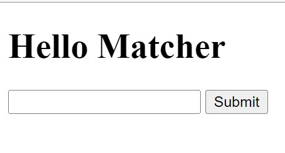
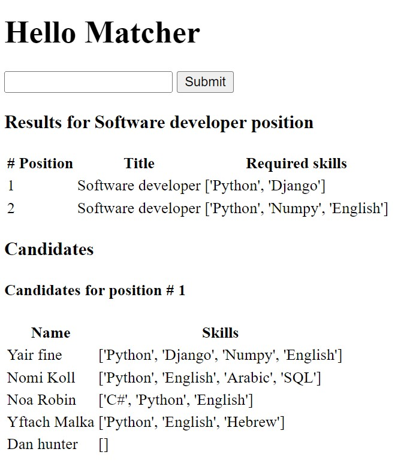
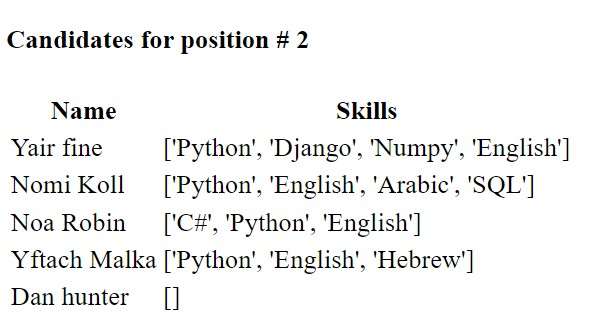
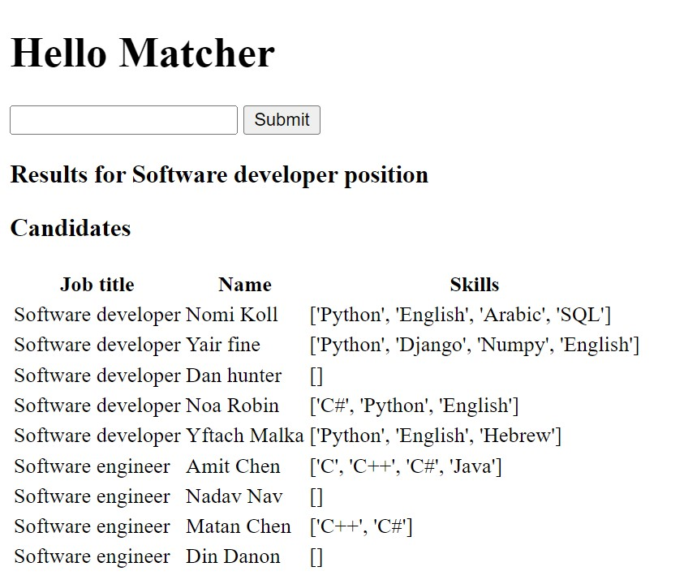

# Gloat Matcher

This repo implements two different end points in django using the MySQL db.

- `job/` - Search candidates according to perfect job title match with max skill match.
- `partial/` - Search candidates according to partial job title match.

## Dependencies

- Download [`MySQL`](https://www.mysql.com/downloads/) and it's Python [client](https://mysqlclient.readthedocs.io/):
  ```bash
  python -m pip install mysqlclient
  ```
- Install [`Django`](https://www.djangoproject.com/)
  ```bash
  python -m pip install Django
  ```

## How to install the project

- First, clone the repo.

- Open the `gloat_matcher/settings.py` and modify the DATABASES section to you relevant database to use.
- Run the `find_uploads.bat` file in order to find the MySQL uploads directory path. Move all the `csv` files to the presented directory.
  The `csv` files are located in the [`data`](https://github.com/nina-kollman/matcher/tree/master/data) directory.
- Change the `init.bat` file as follows: <br>
  **WARNING** this will drop the existing database.
  ```bash
  mysqlsh -u <db_user_name> -p --sql -e "DROP DATABASE <DB_name>;"
  ```
  ```bash
  mysqlsh -u <db_user_name> -p --sql -e "CREATE DATABASE <DB_name>;"
  ```
- Run the `init.bat` file. This will make migrations and load the csv data to the database.
- Now the project is ready to go! You can run the server:
  ```bash
  $ python manage.py runserver
  ```
- Open the given server url with the desired endpoint and start playing!
  ```bash
    http://127.0.0.1:8000/job/
    http://127.0.0.1:8000/partial/
  ```

## Let's Play



### Search 'Software developer' by title in `job/` endpoint:





### Search 'Software developer' with partial matching in `partial/` endpoint:


